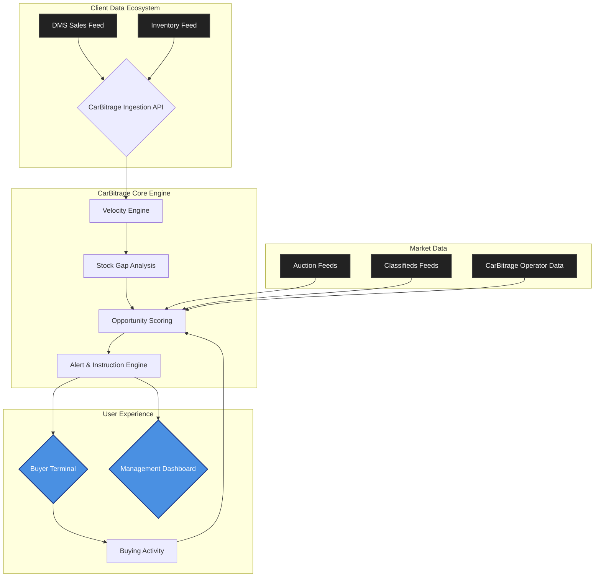

# CarBitrage Fleet: Enterprise Buying Intelligence Specification

**Author:** Manus AI
**Date:** March 01, 2026
**Version:** 1.0
**Status:** Draft

## 1. Core Philosophy: The Closed-Loop Buying System

CarBitrage Fleet is not a notification service. It is a closed-loop, data-driven system for optimizing a large-scale wholesale buying operation. It is designed for the most demanding automotive retailers, for whom a 1% improvement in buying efficiency translates to millions in annual profit. The system operates on a single, uncompromising principle: **every buying decision must be a direct, defensible consequence of real-time sales data.**

We do not provide alerts; we provide buying instructions. We do not show interesting cars; we identify specific inventory gaps and provide the optimal assets to fill them at the right price, right now.

The platform is built to answer the three critical questions for a Head of Used Cars at a 3,000-unit dealership:

1.  **What should we buy today?** (Based on what we sold yesterday)
2.  **How much should we pay for it?** (Based on our actual, recent gross profit for that exact model)
3.  **Is our buying team performing?** (Based on live data, not gut feel)

This document specifies the architecture and components of this system.

---

## 2. System Architecture: The Data Flywheel

The Fleet tier is a single, integrated platform that creates a continuous feedback loop between a dealer's sales performance and their acquisition strategy. The architecture is designed to ingest, analyze, and act upon data at every stage of the vehicle lifecycle.

| Component | Description |
| :--- | :--- |
| **Ingestion API** | The secure endpoint for receiving sales and inventory data from the client's DMS. | 
| **Velocity Engine** | The core analytics engine that calculates sales velocity, margin, and turn rate for every unique make/model/year/trim combination. |
| **Stock Gap Analysis** | Compares current inventory against sales velocity to identify what the dealership is selling but not stocking. |
| **Opportunity Scoring** | Scores every vehicle in the market against the client's specific stock gaps, margin profile, and buying history. |
| **Alert & Instruction Engine** | Generates and delivers precise buying instructions to the right buyer at the right time. |
| **Buyer Terminal** | The interface used by the client's buying team to receive instructions, view market data, and log their activity. |
| **Management Dashboard** | The interface used by the Head of Used Cars to monitor team performance, pipeline value, and overall ROI. |

## 3. Component Specifications

### 3.1. Data Ingestion

Data ingestion is the foundation of the entire system. It must be robust, secure, and flexible enough to handle various DMS outputs.

-   **Primary Method: API Integration.** A dedicated, secure REST API endpoint (`/api/v1/fleet/ingest`) will be provided. The client’s DMS provider or IT team will be responsible for pushing data to this endpoint.
-   **Secondary Method: Automated CSV/XLSX Upload.** For clients without API capabilities, a secure SFTP server or dedicated email inbox will be provided. The system will automatically parse and ingest files dropped into this location.
-   **Required Sales Data Fields:** `stock_number`, `vin`, `make`, `model`, `year`, `trim`, `odometer`, `acquisition_date`, `acquisition_cost`, `sale_date`, `sale_price`, `reconditioning_cost`.
-   **Required Inventory Data Fields:** `stock_number`, `vin`, `make`, `model`, `year`, `trim`, `odometer`, `asking_price`, `days_on_lot`, `location`.
-   **Data Validation & Error Handling:** All incoming data is rigorously validated. Any records that fail validation are flagged and sent to a dedicated error queue for manual review by the CarBitrage account manager. The client is never exposed to data quality issues.

### 3.2. Velocity Engine

The Velocity Engine is the analytical core of the platform. It transforms raw sales data into actionable intelligence.

-   **Core Metrics (calculated per unique vehicle fingerprint):**
    -   **Sales Velocity (30/60/90 days):** Units sold per period.
    -   **Average Days to Sell:** The average time from acquisition to sale.
    -   **Average Gross Profit:** `(sale_price - acquisition_cost - reconditioning_cost)`.
    -   **Gross Margin %:** `(Average Gross Profit / sale_price)`.
    -   **Sell-Through Rate:** `(Units Sold / Units Stocked)`.
-   **Fingerprinting:** A unique vehicle fingerprint is generated based on a normalized combination of `make`, `model`, `year`, `trim`, and `engine_type`. This ensures that we are comparing like-for-like vehicles, even if the DMS data is inconsistent.
-   **Decay Modeling:** The engine applies a decay factor to older sales data, giving more weight to recent transactions. A sale from last week is more relevant than a sale from six months ago.

### 3.3. Stock Gap Analysis

This component identifies the most profitable opportunities by comparing what is selling against what is in stock.

-   **Gap Identification:** The system continuously runs a query: `(Vehicles with high sales velocity and high margin) - (Vehicles currently in stock or recently acquired) = Stock Gap`.
-   **Opportunity Sizing:** Each stock gap is quantified in terms of potential monthly gross profit. `(Units Sold Per Month * Average Gross Profit) = Opportunity Value`.
-   **Prioritization:** Stock gaps are ranked by their Opportunity Value, ensuring that the buying team is always focused on the most lucrative targets.

### 3.4. Opportunity Scoring

This is where market data meets internal intelligence. Every vehicle available in the market (from auctions, classifieds, etc.) is scored against the client’s prioritized stock gaps.

-   **Scoring Factors:**
    1.  **Stock Gap Fit (Weight: 40%):** How well does this vehicle match a high-priority stock gap?
    2.  **Historical Margin (Weight: 30%):** What is the client’s actual, historical gross profit on this exact vehicle fingerprint?
    3.  **Price Competitiveness (Weight: 20%):** How does the asking/guide price compare to the client’s historical acquisition cost and the broader market benchmark?
    4.  **Condition & Provenance (Weight: 10%):** Penalties for WOVR history, noted damage, or poor condition reports.
-   **The Output:** A single, defensible **“Target Acquisition Price”** for every relevant vehicle in the market.

### 3.5. Alert & Instruction Engine

This component turns scores into actionable instructions for the buying team.

-   **Instruction, Not Alert:** The output is not a generic notification. It is a clear, precise buying instruction delivered to the designated buyer.
    > **Example:** “BUY: 2021 Toyota RAV4 Cruiser 2WD. Pickles Perth, Lot 123. Closes 3:15pm. Target Acquisition Price: $31,500. Your 90-day avg sell price is $38,200 (18 days to sell). This fills a high-priority stock gap.”
-   **Buyer Routing:** Instructions are automatically routed to the correct buyer based on pre-defined rules (e.g., “John buys all Toyotas,” “Sarah buys all commercial vehicles”).
-   **Delivery Channels:** Instructions are delivered via a dedicated **Buyer Terminal** interface, with real-time push notifications to desktop and mobile. Email and SMS are used as fallback/summary channels.

### 3.6. The Buyer Terminal

The Buyer Terminal is the primary interface for the client’s buying team. It is designed for speed, clarity, and action.

-   **Live Feed:** A real-time, auto-updating feed of buying instructions, prioritized by urgency (closing time) and opportunity value.
-   **One-Click Action:** Each instruction has clear action buttons: “Acknowledge,” “Log Bid,” “Mark as Won,” “Mark as Lost,” “Pass.”
-   **Integrated Data:** Clicking on an instruction reveals all supporting data: historical sales data, market comparables, condition reports, and links to the source listing.
-   **No Distractions:** The interface is deliberately minimalist. It shows the buyer what they need to know to make a decision, and nothing else.

### 3.7. The Management Dashboard

The Management Dashboard provides the Head of Used Cars with a real-time, 360-degree view of the entire buying operation.

-   **Key Performance Indicators (KPIs):**
    -   **Pipeline Value:** Total value of vehicles acquired today/this week/this month.
    -   **Total Gross Profit Potential:** Sum of expected gross profit from all acquired vehicles.
    -   **Win/Loss Rate:** Percentage of targeted vehicles successfully acquired.
    -   **Cost vs. Target:** Average deviation between the Target Acquisition Price and the actual price paid.
-   **Team Performance:** A leaderboard showing each buyer’s performance against their KPIs.
-   **Inventory Health:** A snapshot of current inventory, highlighting aged stock and identifying which models are moving fastest.
-   **Reporting:** The ability to generate and export custom reports on any aspect of the buying operation.

## 4. Onboarding & Implementation

Onboarding a Fleet client is a high-touch, consultative process.

1.  **Discovery & Scoping (Week 1):** A dedicated workshop with the client to understand their current processes, data systems, and strategic goals.
2.  **Data Integration (Weeks 2-3):** Work with the client’s IT team or DMS provider to establish the sales and inventory data feeds.
3.  **System Calibration (Week 4):** Ingest the last 12 months of historical sales data to calibrate the Velocity Engine and establish the initial stock gap analysis.
4.  **Buyer Training (Week 5):** A hands-on training session with the buying team to introduce them to the Buyer Terminal and the new workflow.
5.  **Go-Live & Hypercare (Week 6):** The system goes live. A CarBitrage account manager provides daily support and monitoring for the first 30 days to ensure a smooth transition and immediate ROI.

This specification outlines a system that is not just a tool, but a fundamental transformation of a dealership’s buying operation. It is a serious machine for a serious customer, designed to deliver a measurable and decisive competitive advantage.
